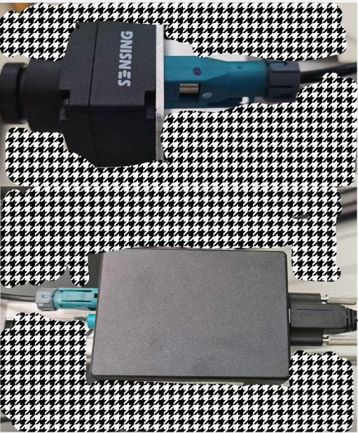
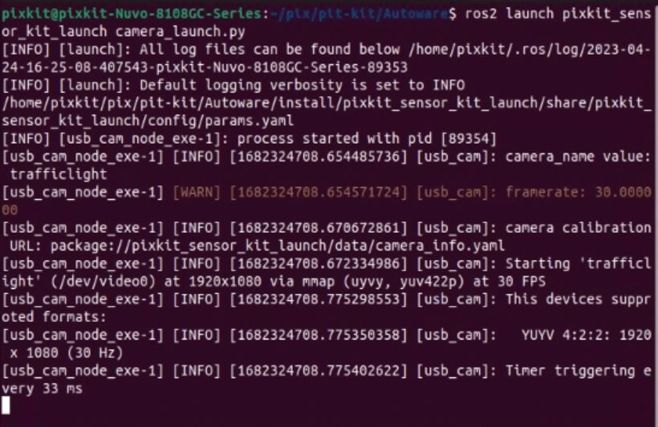
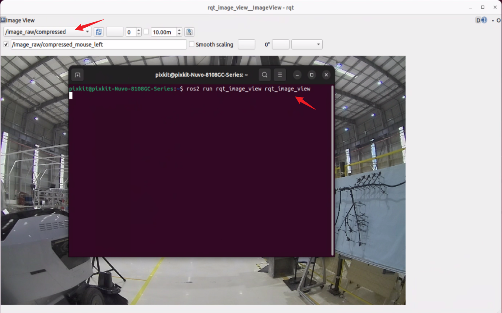

# camera
## Device Wiring
  
## Hardware startup
- Open the industrial computer, press Ctrl+Alt+t to start the terminal
```shell
source  ~/pix/pitkit/Autoware/install/setup.bash 
ros2 launch pixkit_sensor_kit_launch camera_launch.py 
```
- Start the camera driver
    
- View topic data
```shell
ros2 topic list
```
Reopen a terminal
    
-  rqt tool package view
```shell
ros2 run rqt_image_view rqt_image_view
```
Enter the command in the terminal and press Enter, and the visualization interface will pop up automatically .
    
**Note**：If you cannot output the topic list or view the visualization image, please check the wiring harness or check whether the ros driver is started successfully.