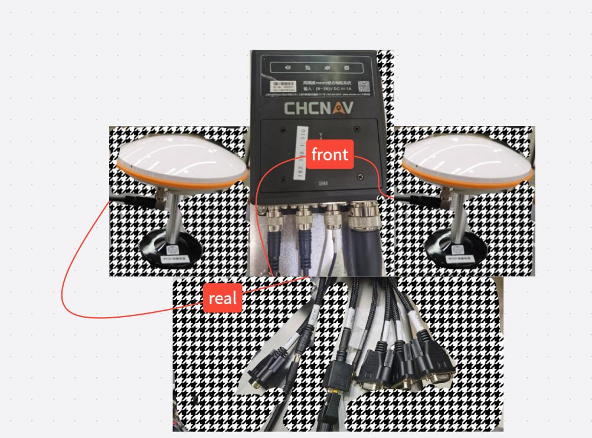
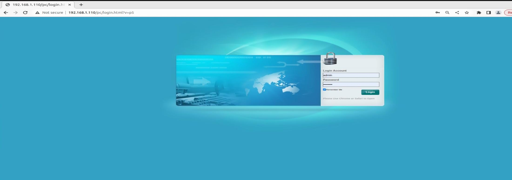
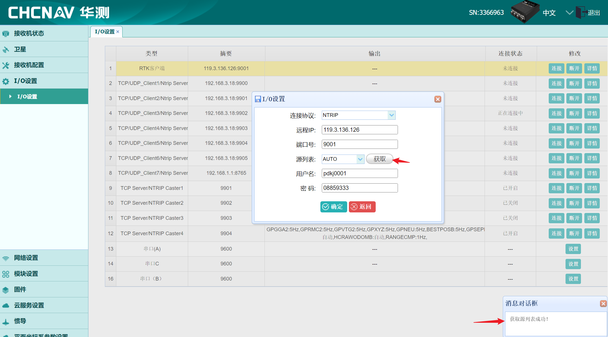
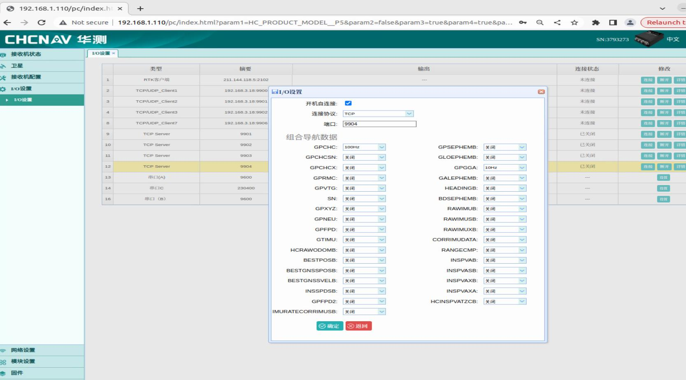
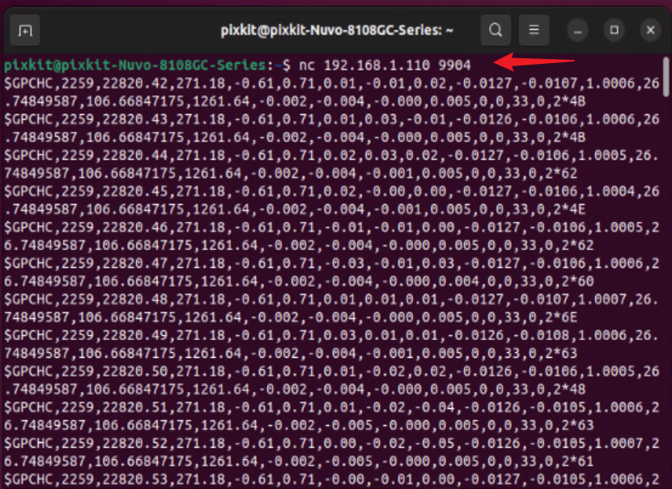
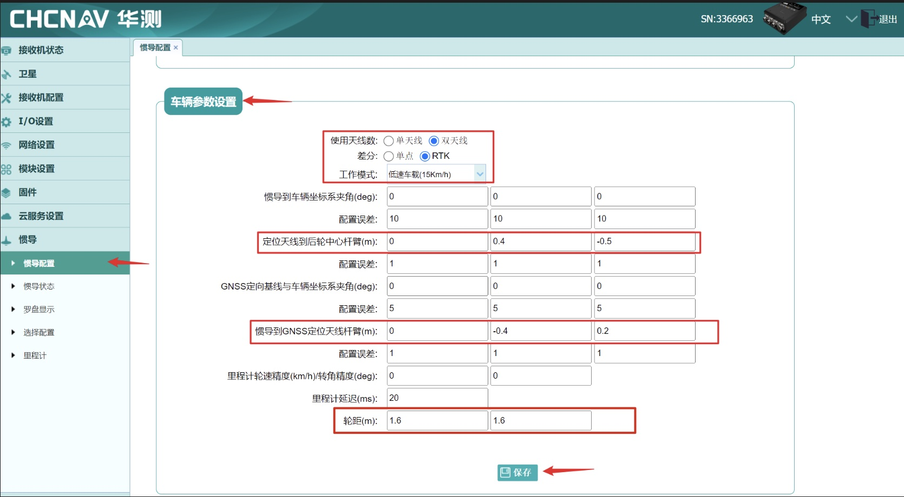
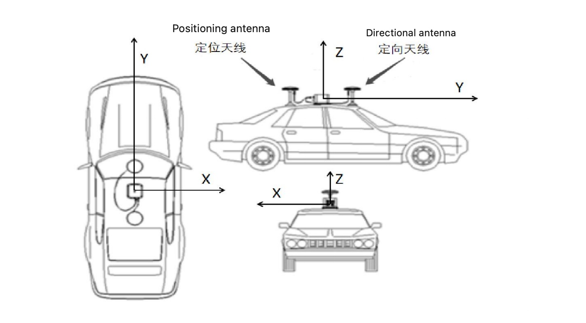

# GNSS—CHC
## Device Wiring
  
## Hardware parameter configuration

### Detection
- Open the Google browser on the industrial computer: enter 192.168.1.110 (factory IP, do not modify) in the address bar, and the login interface pops up. Account: admin, password: password

**Note**：Do not open it with Firefox, otherwise the parameters cannot be modified successfully.
   
### RTK account login (required - your RTK account password)
- Enter the IO configuration interface, select "RTK Client", click "Connect", select NTRIP protocol as the connection protocol, enter your account password and remote IP, port, get the source list, select RTCM33, and finally click "OK".
    

**Note 1**：When obtaining the source list, be sure to pay attention to the pop-up source list in the lower right corner to obtain the source list successfully, otherwise RTK login fails. Check whether the device is supplied with network.

**Note 2**：CGI-410 supports foreign differentials, but it must ensure that the base station broadcasts standard RTCM sentences. Domestic and foreign satellites are uniformly supported: GPS, Beidou, Galileo, GLONASS, and Quasi-Zenith.

### Parameter adaptation (optional - configured)
#### Data I/O Output
- Output format TCP: Enter the IO configuration interface, check the TCP Server 9904 port, set the combined navigation data separately: GPCHC 100HZ, GPGGA 10HZ, and close other data, and save the data.
    
- Start the industrial computer, press Ctrl+Alt+t to open the terminal, nc 192.168.1.110 9904, and data output indicates that TCP communication is successful;
    

### Vehicle parameter settings (optional - configured)

> If you purchase a PIXKIT kit, no need, it is already set up at the factory.

- Number of antennas used: Connect the rear antenna to the GNSS1 device for positioning, and connect the front antenna to the GNSS2 device for heading;
- Operating mode: Select "Mobile Robot" and choose the low-speed mode;
- IMU to Vehicle Coordinate System Angle: Standard installation with all parameters set to 0;
- `Positioning Antenna to Rear Wheel Center Arm`：Use the positioning antenna as the origin coordinate. Provide values for x, y, and z directions: x represents left and right (positive for right, negative for left), y represents front and back (positive for front, negative for back), z represents up and down (positive for up, negative for down) in meters. For example, if the antenna is 0.3 meters to the left of the rear wheel center (usually placed on the vehicle's centerline, so it would be 0), 0.5 meters to the front, and 1 meter above, the input values would be 0.3, -0.5, -1;
- GNSS Heading Baseline to Vehicle Coordinate System Angle: Standard installation with all parameters set to 0;
- `IMU to Positioning Antenna Arm`：Use the IMU device as the origin coordinate. Provide values for x, y, and z directions: x represents left and right (positive for right, negative for left), y represents front and back (positive for front, negative for back), z represents up and down (positive for up, negative for down) in meters. If the positioning antenna is located to the right, front, and above the device, then x, y, and z values should all be positive;
- Odometry Wheel Speed Accuracy (km/h) / Steering Angle Accuracy (deg) and Odometry Delay: Leave the default values at 0;
- `Wheelbase`：Measure and fill in the wheelbase value based on the received vehicle;
- Once the configuration is complete, click "Save" to apply the settings.

1. `Wheelbase`:  The distance between the centers of the two rear wheels, represented by length `D` in the diagram.
2. `IMU to Positioning Antenna Arm`: Consider the `Main Unit` as the origin of the coordinate system. The `Positioning Antenna` is considered as a point in this coordinate system. Provide the x, y, and z values of the `Positioning Antenna` in the coordinate system of the "Main Unit." For example, (E, -A, F).
3. `Positioning Antenna to Rear Wheel Center Arm`: Consider the `Positioning Antenna` as the origin of the coordinate system. The `Rear Wheel Center` is considered as a point. Provide the x, y, and z values of the `Rear Wheel Center` in the coordinate system of the`Positioning Antenna`.

### Device Calibration
Real Vehicle Operation: In the INS mode, start with GNSS, then initialize, and finally combine with the inertial navigation system. The vehicle must be driven outdoors in an open area with no tall obstructions. Move the vehicle back and forth, drive in a figure-eight pattern, and make turns. It will take approximately twenty minutes for the calibration process to be successful. If the INS mode remains unchanged, please check if the RTK account has logged in successfully.
**Inertial navigation fusion status**： INS mode is combined inertial navigation state, combined information is GNSS | MIU
    
**注意**：Calibration takes about 30 minutes. If the INS mode initializes but the GNSS mode does not show a stable RTK positioning and heading solution, please check the device's RTK status, arm values, and antenna connections (whether the rear antenna is connected to GNSS1 and the front antenna is connected to GNSS2). If the device is installed in a complete vehicle project and difficult to inspect, check the heading angle in the attitude information of the inertial navigation status. Use a compass on a mobile phone aligned with the vehicle's direction of travel. Verify if the angles are consistent. Deviation within 10 degrees is normal. If the deviation exceeds 180 degrees, it indicates a reversed connection. In that case, interchange the positions of the GNSS1 and GNSS2 interfaces.

- If you need to use other parameters, please refer to the CGI-410 User Manual.
    [CGI-410使用手册](./image/CGI-410.pdf)