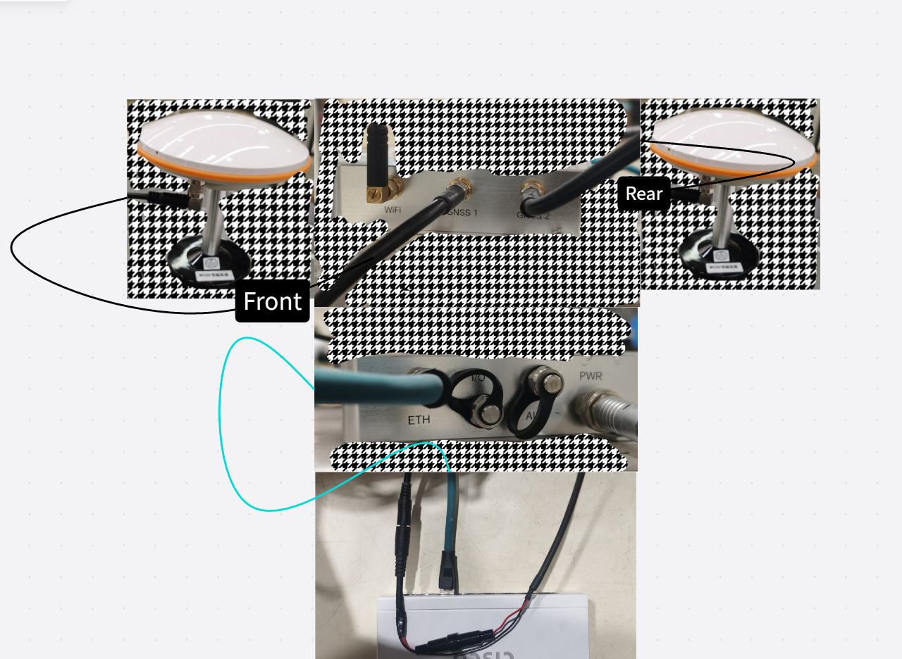
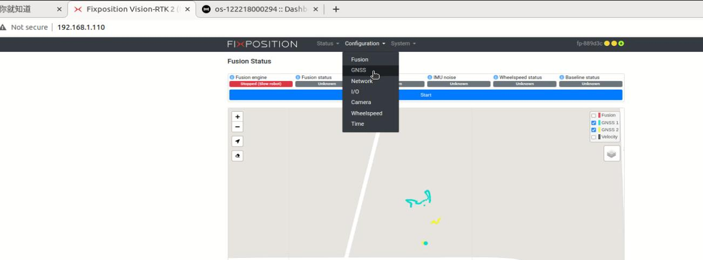
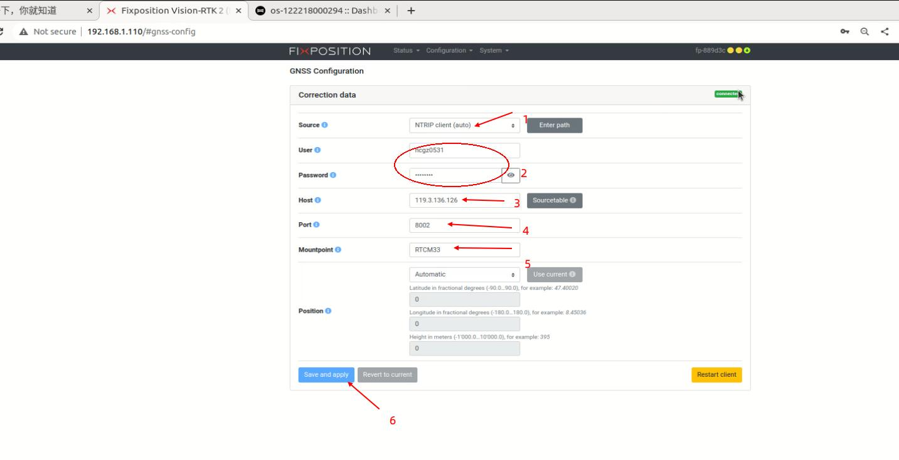
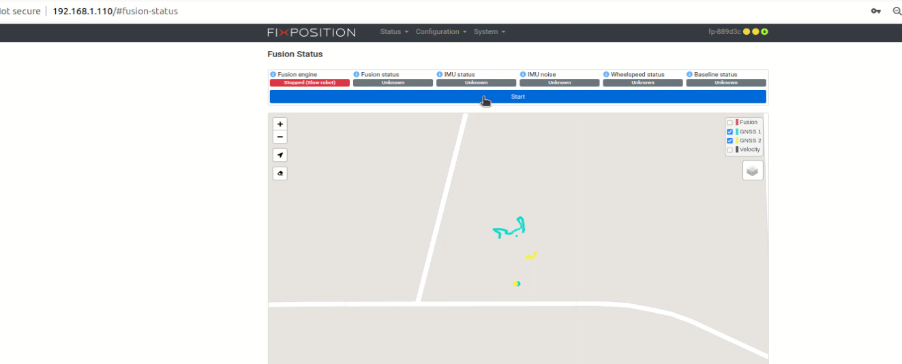
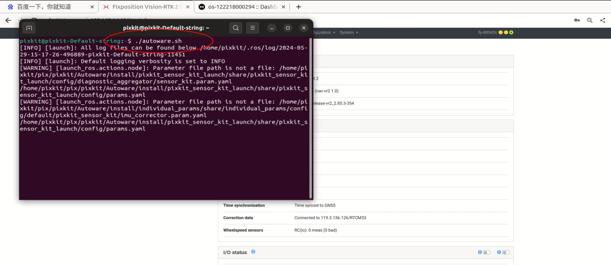
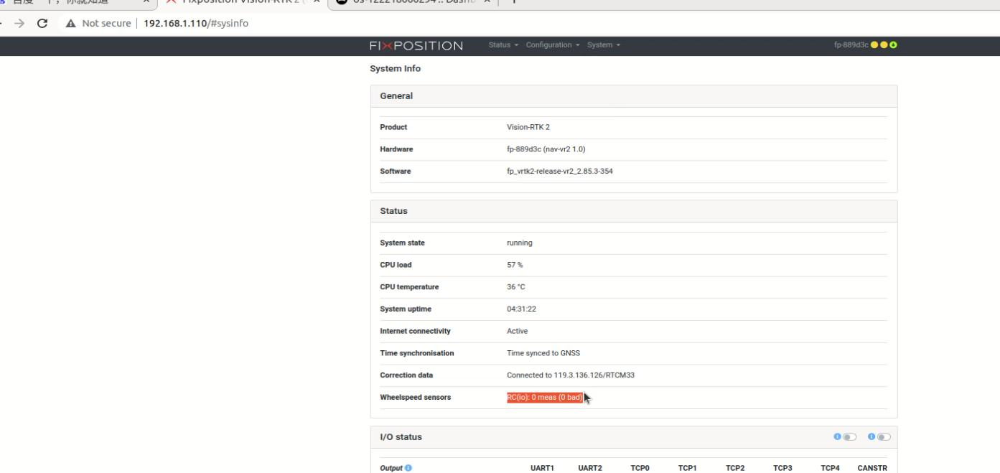
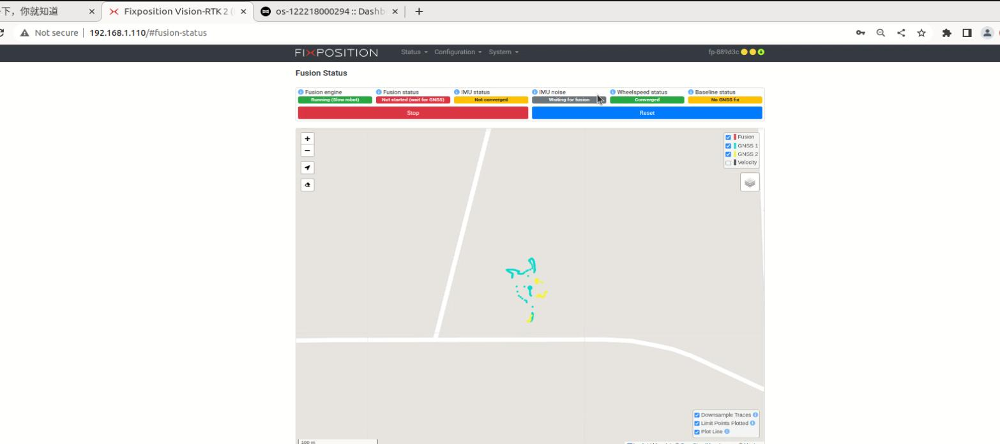
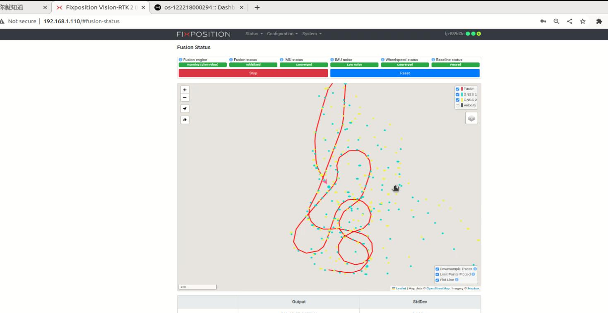

# GNSS—FP
## Device Wiring
   
## Hardware parameter configuration
### Detection
- Open the Google browser on the industrial computer: enter 192.168.1.110 in the address bar (factory IP, do not modify)
### RTK account login (required - your RTK account password)
- After entering the fixposition webpage, select GNSS under Configuration
    
- Enter rtk and set as follows: user: your account, password: your password, Host: 119.3.136.126, Mountpoint: RTCM33
    
**Note 1**： Check whether the network is normal, otherwise RTK login fails, check the network device.
### Data Check

```shell 
nc 192.168.1.110 21000
```

### Device Calibration
```shell 
Move the vehicle outdoors and let it remain stationary for about 5 minutes. Then, when the vehicle is in motion, drive it in a figure-eight pattern, making loops and turning both forward and backward. Ensure that the front of the vehicle, where the mushroom antenna is located, is connected to GNSS1, and the rear is connected to GNSS2. Also, check the connected RTK account.
```
- Return to the home page and click start
  
- FP devices require wheel speed feedback, which will be integrated faster. Execute autoware.sh to start, give an initial position, and display the point cloud on the map. Here you need to pay attention to whether the chassis is connected to auotware normally. You can turn the remote control steering wheel left and right to check the steer changes on rviz2. If there is no data, restart autoware, and activate it when the radar does not display.

  Select info under System on the web page to view Wheelspeed sensors. If there is data feedback, it means the wheel speed is connected
  
- Before fusion: The vehicle moves in a figure 8, turns and goes straight for a distance. It takes about 10 minutes until all states are green.
  
- Status after fusion: After fusion, all statuses are green, indicating fusion.
  

- Reference Manual  
    [VRTK Documentation](./image/VRTK2%20快速使用手册2.0.pdf)