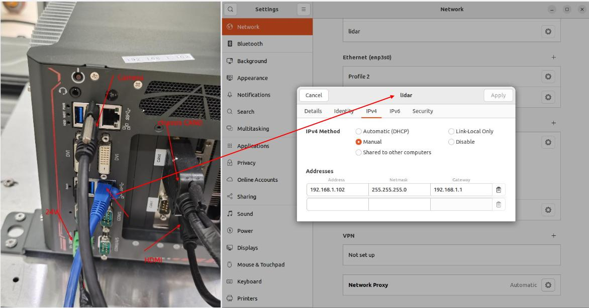
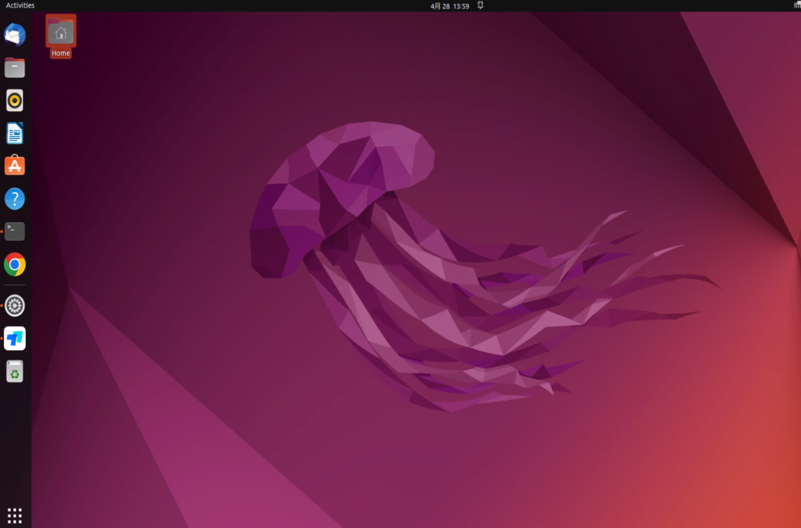
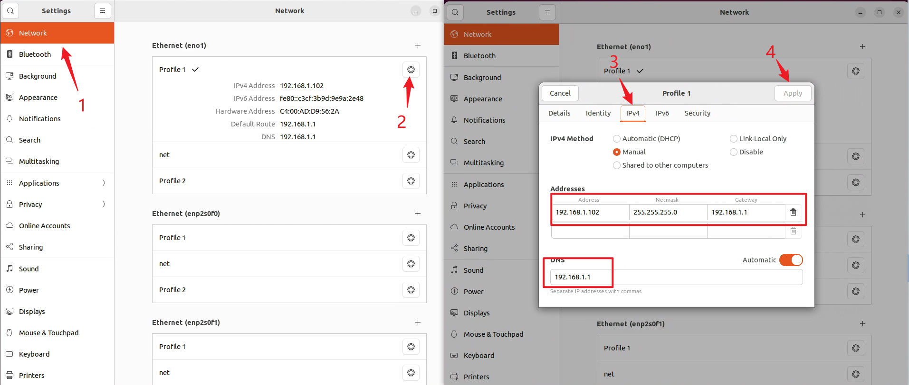
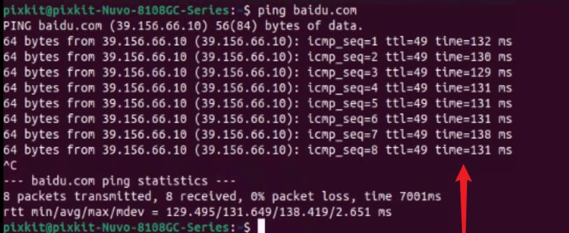
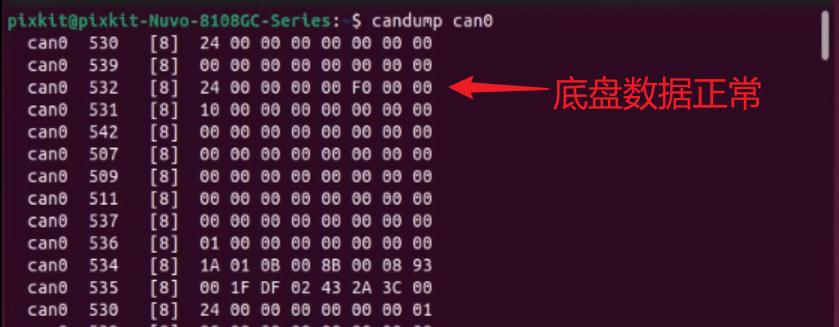
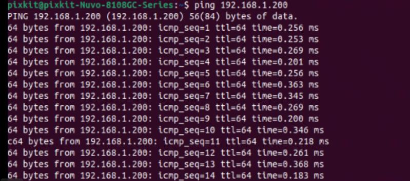
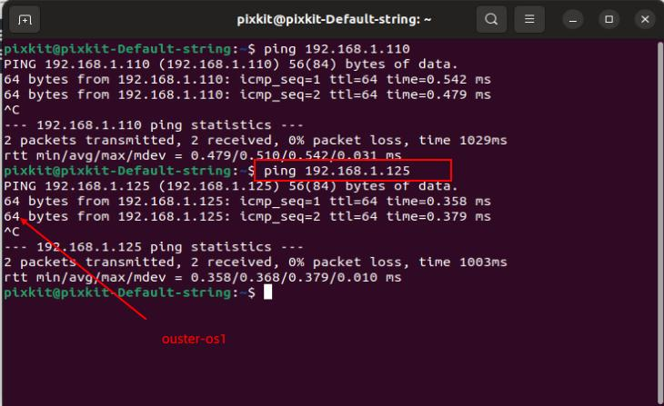
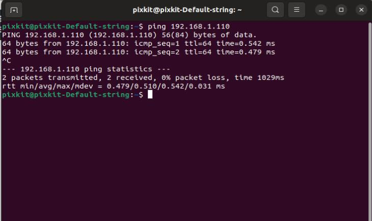

# IPC
Username：pixkit， Password：pixmoving
## Device Wiring
**Note** All sensor devices (except cameras) need to be connected to the vehicle's 12V power supply and the industrial computer's 24V power supply, and the RJ45 network cable transmits data lidar-ouster, robosense, fixposition and CHC.
lidar-ouster、robosense、fixposition和CHC。 
 
## IPC Network Settings

> Connect the RJ45 network cable of the switch or router to the network port of the industrial computer (IPC)
    
Note：The picture is for reference only. If the model of the industrial computer does not match the picture, pay attention to the connection of the network port.
- After the wiring is completed, click the power button and wait for a few seconds to log in to the interface.
    
- Ctrl+Alt+t starts the terminal terminal   
  **Note**：Ctrl+Alt+t is to open the terminal, Ctrl+c is to end the terminal, and Ctrl+shift+t is to open the side terminal. The document will not be repeated later.
### Check the host static IP
Open the network settings, check the current connection port, click IPV4 to view, if different, modify according to the picture, and click Apply after completion.
    

- Check the host static IP (ifconfig): If the static IP address is not 192.168.1.102, you need to check the network settings, otherwise the sensor data transmission is abnormal
    
###  Check the network 
  If you cannot access the Internet, please check DNS192.168.1.1 or change the router network port.
```shell
ping baidu.com
```
 

**Note 1**：Do not modify the router IP address. If you cannot access the Internet, check the network port connection, check the DNS, and access the router through the browser.


### Check chassis CAN data
- The chassis's CAN data interface needs to be connected to the CAN0 interface. If data cannot be output, please replace the CAN port.
```shell
candump can0
```
Terminal output data is normal
    

### Inspecting lidar data 
   RS-Helios-16P static IP 192.168.1.200    
   OUSTER-OS     static IP 192.168.1.125
                   
```shell
ping 192.168.1.200
ping 192.168.1.125
```
Terminal output data is normal
    
    

### Check the integrated inertial navigation
192.168.1.110
```shell
ping  192.168.1.110
```
Terminal output data is normal
    
