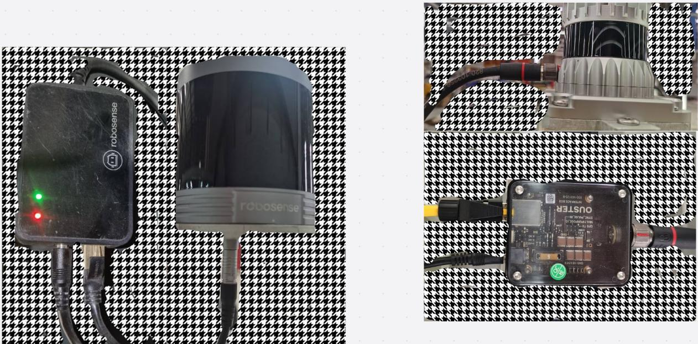
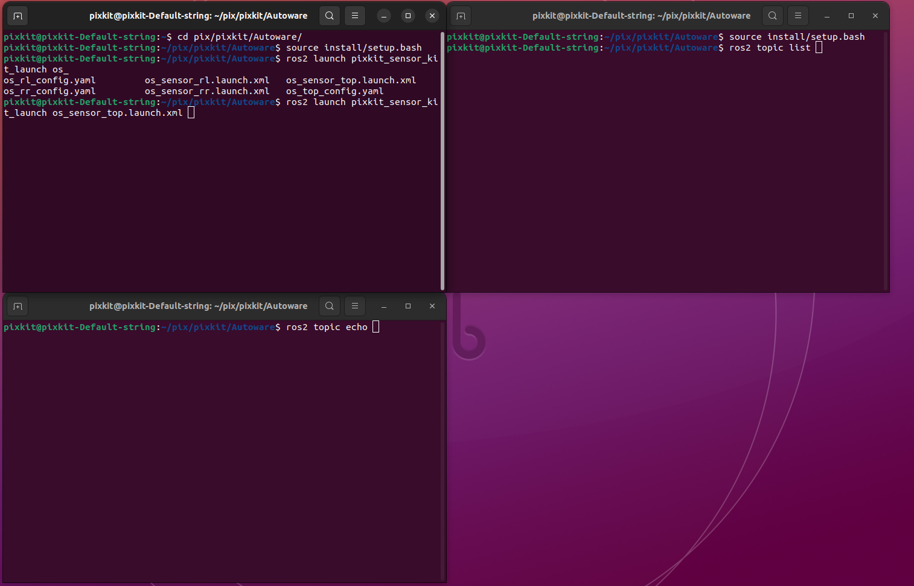
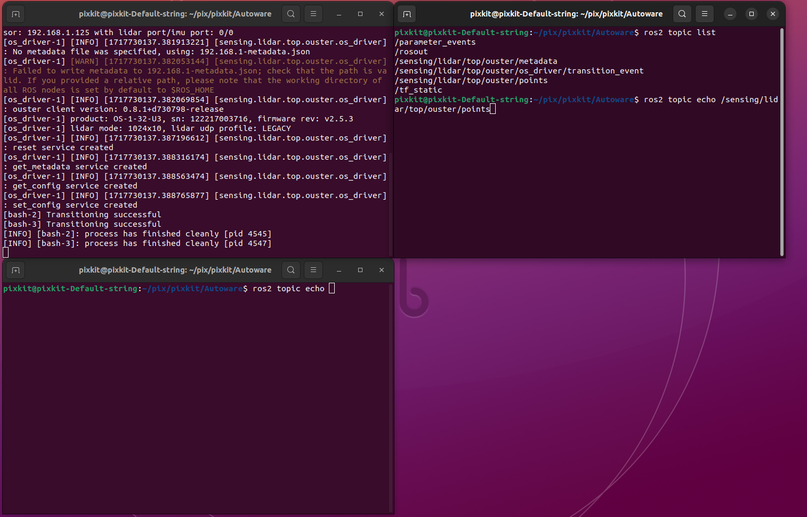
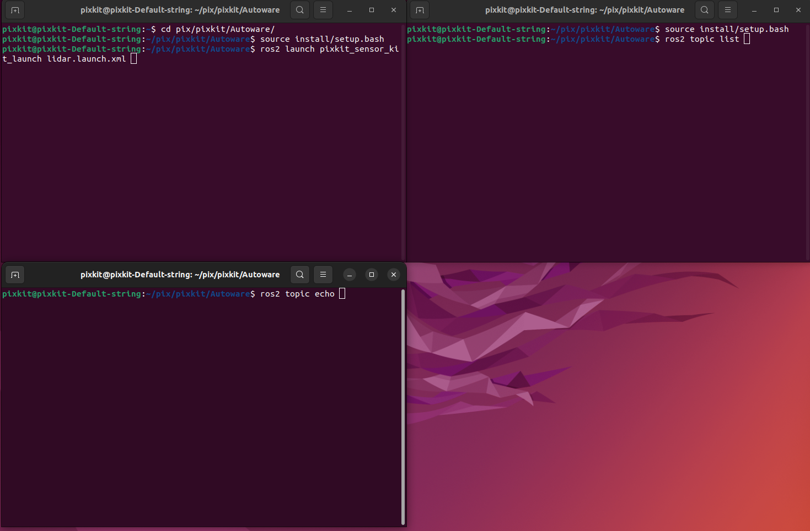
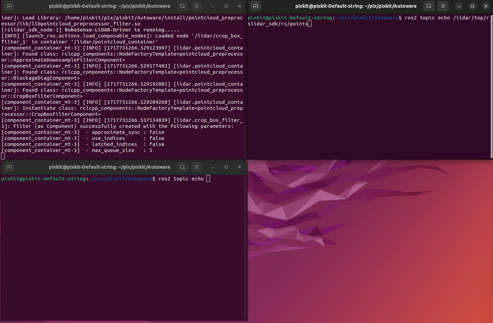

# LiDAR
## Device Wiring
 
### Device

- Radar model: RS-Helios-16P or OUSTER-OS

- Radar static IP: 192.168.1.200 (RS-Helios-16P) or 192.168.1.125 (OUSTER-OS) (do not modify)

### ROS Driver
Under the Autoware file

#### ouster_driver
```shell 
source install/setup.bash
ros2 launch pixkit_sensor_kit_launch os_sensor_top.launch.xml
``` 
 
 View the lidar/points topic through ros topic list, echo can print the topic output
  
#### rs_driver
```shell 
source install/setup.bash
ros2 launch pixkit_sensor_kit_launch lidar.launch.xml
``` 
  
   通过ros topic list 查看 lidar/points的话题，echo可以打印话题输出
    
 
 
- Driver Download：[RS-Helios-16p](https://github.com/RoboSense-LiDAR/rslidar_sdk)
- Driver download：[OUSTER-OS](https://github.com/ouster-lidar/ouster-ros)
