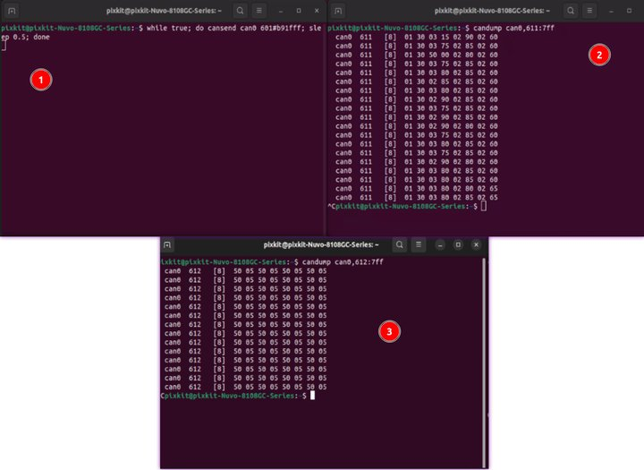
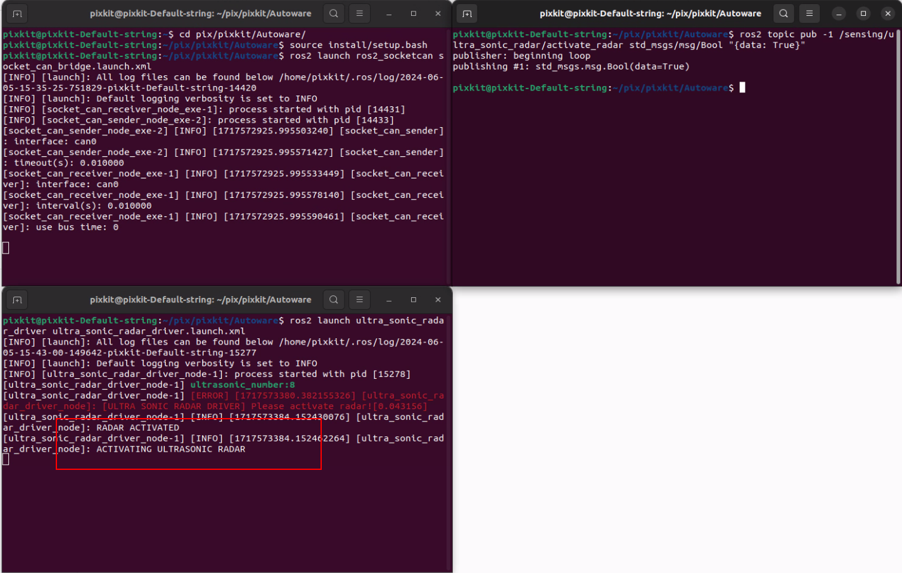

# Ultrasonic radar
## Device 
- Normal connection to CAN0
## Hardware Activation Check
- Hardware installation has been completed
- Start Terminal
```shell
Activation Ultrasonic：while true; do cansend can0 601#b91fff; sleep 0.5; done
View search data for No. 1-4：candump can0,611:7ff
View search data for No. 5-8：candump can0,612:7ff
```
 

## Hardware startup
- Open Terminal under the auotware file
```shell
1. CAN Drive
    source install/setup.bash 
    ros2 launch  ros2_socketcan socket_can_bridge.launch.xml
2. Ultrasonic Drive
    source install/setup.bash 
    ros2 launch ultra_sonic_radar_driver mc_radar_driver.launch.xml
3. Super active topic——can communicate with ros2 topic list
    ros2 topic pub -1 /sensing/ultra_sonic_radar/activate_radar std_msgs/msg/Bool "{data: True}"
```
 
'ACTIVATING ULTRASONIC RADAR' means the startup is successful

- Reference Documentation

    [F40-16TR9BL2 Ultrasonic Sensor CAN User Documentation](./image/F40-16TR9B.pdf)

    [F40-16TR9BL2 Driver](https://github.com/pixmoving-moveit/ultra_sonic_radar_driver/tree/ros2-8-probes-ultra)
