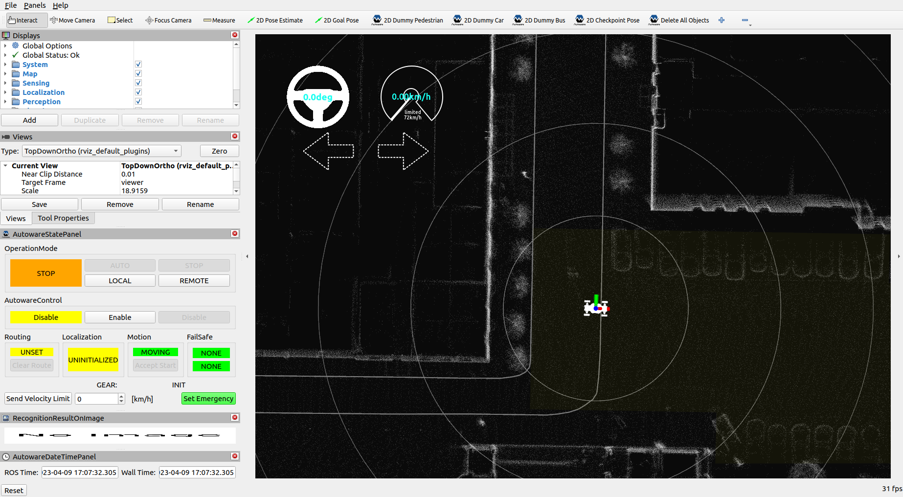
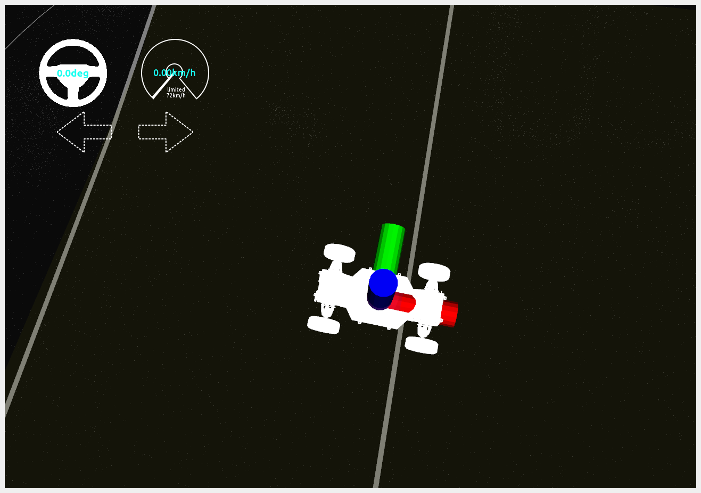
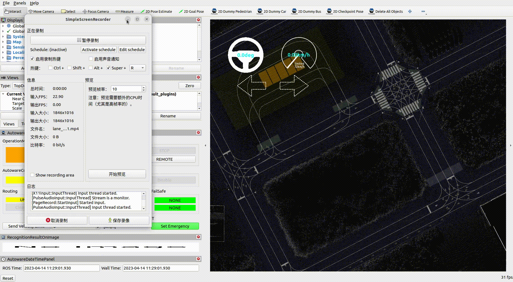
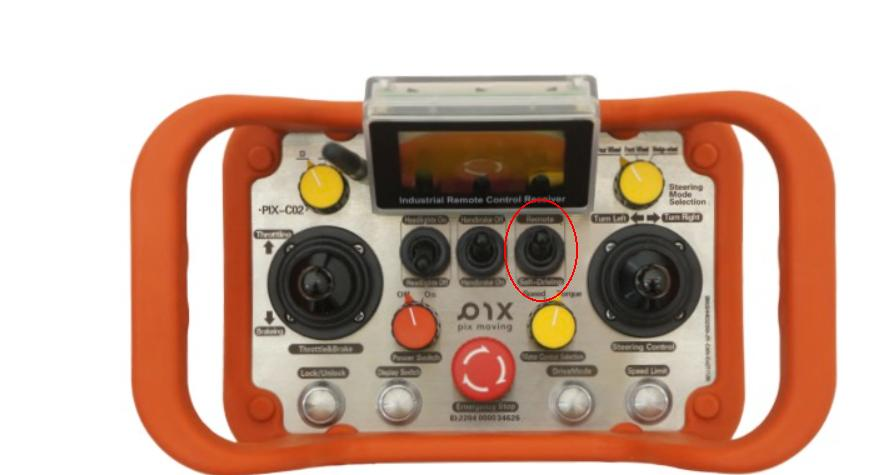

# Start Autoware

Autoware consists of two parts: simulation and real vehicle operation. For simulation, please refer to [Autoware Simulator Tutorials](https://autowarefoundation.github.io/autoware-documentation/main/tutorials/). For real vehicle operation, please refer to the following documentation.
## Launch File and Parameter Configuration
You can start Autoware with the following command:
``` shell
ros2 launch autoware_launch autoware.launch.xml \
map_path:=$HOME/autoware_map/factory_20230325 \ #Change your map file
vehicle_model:=pixkit \
sensor_model:=pixkit_sensor_kit
```
The above commands can be divided into the following 5 parts

- `autoware_launch`：The package where the launch file is located
- `autoware.launch.xml`： launch file
- `map_path`：  Contains point cloud map (pointcloud_map.pcd) and vector map (lanelet2_map.osm), and map address parameters. For map production methods, refer to[the map](../%E5%9C%B0%E5%9B%BE/index.md)
- `vehicle_model`： Vehicle model parameters, the corresponding vehicle [urdf model](https://docs.ros.org/en/humble/Tutorials/Intermediate/URDF/URDF-Main.html)and[autoware interface](https://github.com/pixmoving-moveit/pix_driver) will be selected according to the parameters , refer to[pixkit_launch](https://github.com/pixmoving-moveit/pixkit_launch)
- `sensor_model`： ensor model parameters, the corresponding sensor[urdf model ](https://docs.ros.org/en/humble/Tutorials/Intermediate/URDF/URDF-Main.html)and sensor driver will be selected according to the parameters, refer to [pixkit_sensor_kit_launch](https://github.com/pixmoving-moveit/pixkit_sensor_kit_launch)

## Startup interface
After the above command runs normally.[rviz2](https://github.com/ros2/rviz) window will appear.

In the visualization window, you can see the imported chassis model and your point cloud map and vector map.
## Start successful verification
- [Verify that the map was imported](#verify-that-the-map-was-imported)
- [Verify that the vehicle model is started](#verify-that-the-vehicle-model-is-imported)
- [Verify that the sensor is started normally](#verify-that-the-sensor-is-started-normally)
### Verify that the map was imported
Use the following methods to check whether there is a map import
- You can directly observe whether there is a point cloud map and a vector map in rviz 
- Use [ros2 cli](https://docs.ros.org/en/foxy/Tutorials/Beginner-CLI-Tools.html) to check whether there is map data published. If there is data output, it means that the map import is normal. The command is as follows
``` bash
ros2 topic echo [topic name]
```

| **Topic** | **Type** | **Describe** |
|------| ------ | ------ |
| /map/pointcloud_map | sensor_msgs/msg/PointCloud2 | Point cloud map |
| /map/vector_map | autoware_auto_mapping_msgs/msg/HADMapBin | Vector map (lanelet2 format) |

### Verify that the vehicle model is imported
1. Observe whether there is a vehicle model in the rviz visualization window, as shown in the figure below

2. Check whether the chassis feedback is normal. The topic of chassis feedback is shown in the table below. Also use the remote control to check whether the deg on rviz2 changes. If there is a change, it means it is connected. If it cannot be closed, wait for 30 seconds and restart auotware to observe. The command is as follows
``` bash
ros2 topic echo [topic name]
```

| **Topic** | **Type** | **Describe** |
| ------ | ------ | ----------- |
| /vehicle/status/control_mode | autoware_auto_vehicle_msgs::msg::ControlModeReport | 	Chassis Control Mode Feedback |
| /vehicle/status/velocity_status | autoware_auto_vehicle_msgs::msg::VelocityReport | Chassis speed feedback |
| /vehicle/status/steering_status | autoware_auto_vehicle_msgs::msg::SteeringReport | Chassis steering feedback |
| /vehicle/status/gear_status | autoware_auto_vehicle_msgs::msg::GearReport | Chassis gear feedback |
| /vehicle/status/turn_indicators_status | autoware_auto_vehicle_msgs::msg::TurnIndicatorsReport | Chassis turn signal feedback |
| /vehicle/status/hazard_lights_status | autoware_auto_vehicle_msgs::msg::HazardLightsReport | 	Chassis emergency light status feedback |

### Verify that the sensor is started normally
1. Use [ros2 cli](https://docs.ros.org/en/foxy/Tutorials/Beginner-CLI-Tools.html) to check whether there is any sensor data released. If there is data released, it means that the sensor is started normally. If the point cloud cannot be displayed on the map, the radar needs to be activated. The command is as follows:
``` bash
ros2 topic echo [topic name]
```
| **Topic** | **Type** | **Describe** |
| ------ | ------ | ----------- |
| /sensing/lidar/top/outlier_filtered/pointcloud | sensor_msgs/msg/PointCloud2 | LiDAR Data|
| /sensing/imu/imu_data | sensor_msgs/msg/Imu | IMU Data |

- Activate radar script：./activte_ouster.sh

### Given a starting point and an end point
 - 2D pose Estimate:The current vehicle position on the map needs to be matched
 - 2D Goal Pose：End point
 - Send Velocity Limit:Fill in the initial speed 3~5 (unit KM/h), click Send Velocity Limit to take effect 
 
### Click the AUTO button
 Switch the remote control to self_driving (in this state, only emergency parking is available on the remote control). When the vehicle is in automatic driving, please pay attention to the surrounding vehicles and roads, and make an emergency stop (press the red button in the center of the remote control or step on the brake when switching back to remote control mode).
  


## Precautions

- Before starting, you need to ensure that the map file exists. If the folder specified by map_path does not exist or the file does not exist, the startup will fail.