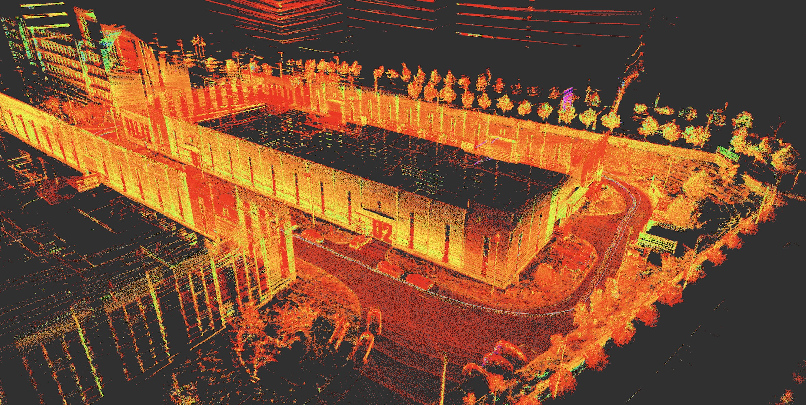
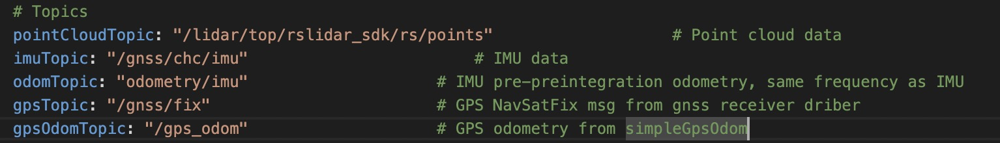
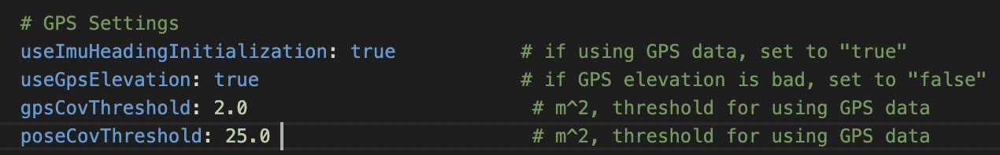
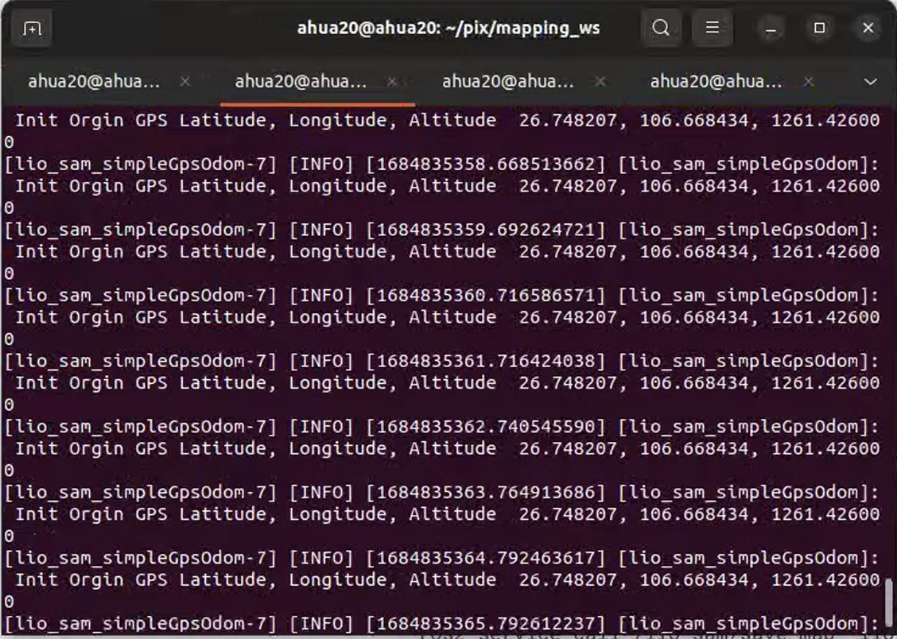
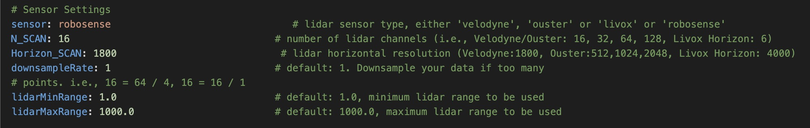
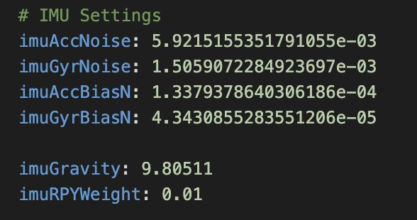
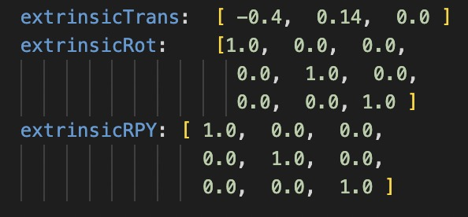

# Building  map
## Overview
Purpose: Use the mapping program to obtain a map (GlobalMap.pcd)
## LIO-SAM-6AXIS


### step-1 Calibrate the sensor (the initial parameters have been set, you can skip it. If the mapping effect is not good, please recalibrate it)
- [IMU Calibration](../sensor-calibration/IMU-calibration.md)
- [LiDAR-IMU-Calibration](../sensor-calibration/LiDAR-IMU-calibration.md)


### step-2  Record ros2 bag
 **注意** Check the topic output before recording. During the recording process, the vehicle should be driven as smoothly and slowly as possible. It is recommended to loop your map scene.

 - Start autoware first:./autoware.sh [Note](../Autoware上手/启动autoware.md)
```shell
Method 1 ：cd  ~/pixkit/pix/ros2_bag
                  ros2 bag record $(cat rosbag.txt)
Method 2 ：cd  ~/pixkit/pix/ros2_bag（by yourself）
                  ros2 bag record  /lidar_topic /gnss_topic /imu_topic 
                  Here   /lidar_topic：lidar topic
                        /gnss_topic ：gbss topic
                        /imu_topic  : imu topic
```

### step-3 Modify the config file
run.launch under launch file:
```python3
import os
from ament_index_python.packages import get_package_share_directory
XXX
XXX

def generate_launch_description():

    share_dir = get_package_share_directory('lio_sam')
    parameter_file = LaunchConfiguration('params_file')
    xacro_path = os.path.join(share_dir, 'config', 'robot.urdf.xacro')
    rviz_config_file = os.path.join(share_dir, 'config', 'rviz2.rviz')

    params_declare = DeclareLaunchArgument(
        'params_file',
        default_value=os.path.join(
            share_dir, 'config', 'params_rs16.yaml'),
        description='FPath to the ROS2 parameters file to use.')
```
`params_rs16.yaml`：Read the configuration file under config. If you need to change it, please pay attention here

- You need to modify the topic configured for your sensor


|**parameter**|**msg type**|**describe**|
|--|--|--|
|pointCloudTopic|sensor_msgs/Pointcloud2|The topic where you recorded the LiDAR point cloud|
|imuTopic|sensor_msgs/Imu|The topic where you recorded the IMU|
|odomTopic|nav_msgs/Odometry|IMU odometer topic, no modification required|
|gpsTopic|nav_msgs/NavSatFix|The positioning topic you recorded for GNSS|

- If GNSS is used for orientation initialization, it needs to be`useImuHeadingInitialization`set to `true`，



### step-4: Run the mapping program
 **Note** Must end autoware

Run the map launch file under mapping_ws
```shell
source install/setup.bash
ros2 launch lio_sam run.launch.py
```

### step-5: play ros2 bag
```shell
ros2 bag play  [your_ros2_bag] --clock 
your_ros2_bag： Play ros2 bag, the following operations are required after playing completed ros2 bag
```
### step-6: Save the map
Under the mapping_ws file：
```shell
source install/setup.bash
ros2 service call /lio_sam/save_map  lio_sam/srv/SaveMap 
```
The saved map is in LOAM under Downloads and will be used

|**name**|**describe**|
|--|--|
|GlobalMap.pcd|Point cloud map，import [Vector Map Builder](https://tools.tier4.jp/feature/vector_map_builder_ll2/) to draw, if using GNSS, the direction has been converted to ENU direction|

The origin WGS84 coordinates of the point cloud map, used for GNSS positioning
> It is recommended to save the information in the terminal for easy use in GNSS positioning. 
   

## Code git
### prerequest
- Ubuntu 22.04
- ROS2 Humble

### step-1: Build a drawing workspace
Create a workspace
```shell
mkdir ~/mapping_ws
cd ~/mapping_ws
mkdir src
cd src
```

### step-2 clone
```shell
git clone https://github.com/pixmoving-moveit/LIO-SAM-ROS2-PIXKIT # clone 
```

### step-3  Install dependencies
```shell
sudo apt install ros-humble-perception-pcl \
  	   ros-humble-pcl-msgs \
  	   ros-humble-vision-opencv \
  	   ros-humble-xacro
# Add GTSAM-PPA
sudo add-apt-repository ppa:borglab/gtsam-release-4.1
sudo apt install libgtsam-dev libgtsam-unstable-dev
```

### step-4 colcon build package
```shell
cd ~/mapping_ws
colcon build --symlink-install --cmake-args -DCMAKE_BUILD_TYPE=Release
```

## LiDAR Parameters

  

|**parameter**|**describe**|
|--|--|
|sensor|LiDAR type, optional `velodyne`, `ouster`, `livox`, `robosense`|
|N_SCAN|Point cloud channel number, 16-line laser radar is 16|
|Horizon_SCAN|LiDAR lateral resolution, (Velodyne: 1800, Ouster: 512, 1024, 2048, Livox Horizon: 4000)|
|downsampleRate|Downsample rate, let N_SCAN/downsampleRate=16|
|lidarMinRange|Minimum point cloud distance, default is 1.5|
|lidarMaxRange|Maximum point cloud distance, default is 1000.0|

- IMU internal parameters, refer to [IMU标定](../%E4%BC%A0%E6%84%9F%E5%99%A8%E6%A0%87%E5%AE%9A/IMU%E6%A0%87%E5%AE%9A.md)to obtain IMU internal parameters



|**parameter**|**describe**|
|--|--|
|imuAccNoise|3-axis accelerometer white noise mean (m/s^s)|
|imuGyrNoise|3-axis gyro white noise mean (rad/s)|
|imuAccBiasN|3-axis accelerometer zero bias mean (m/s^s)|
|imuGyrBiasN|3-axis gyro bias mean (rad/s)|
|imuGravity|	Local gravity acceleration (m/s^2)|
|imuRPYWeight|Angle weight, default 0.01|

- IMU external parameters，refer to[LiDAR与IMU外参标定](../%E4%BC%A0%E6%84%9F%E5%99%A8%E6%A0%87%E5%AE%9A/LiDAR-IMU%E6%A0%87%E5%AE%9A.md)

> IMU extrinsic parameters can be measured by [LiDAR and IMU extrinsic calibration] or manually measured with a tape measure (the coordinate system is the right-hand rule)
> When measuring manually：
> - extrinsicTrans:manual measurement with a tape measure 
> - extrinsicRot: the unit matrix is ​​sufficient




|**parameter**|**describe**|
|--|--|
|extrinsicTrans|Translation Matrix|
|extrinsicRot|Rotation Matrix|

## References
- [LIO_SAM](https://github.com/TixiaoShan/LIO-SAM)

- [LIO_SAM_6AXIS](https://github.com/JokerJohn/LIO_SAM_6AXIS)

- [LIO-SAM-ROS2-PIXKIT](https://github.com/pixmoving-moveit/LIO-SAM-ROS2-PIXKIT)

- [creating maps for Autoware](https://autowarefoundation.github.io/autoware-documentation/pr-335/how-to-guides/creating-maps-for-autoware/open-source-slam/fast-lio-lc/)